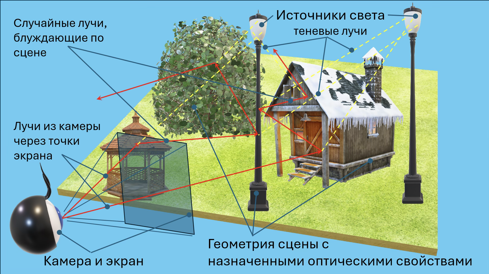

# Лабораторная работа 4

- Выполнили: Кузьмин Артемий Андреевич, Силинцев Владислав Витальевич
- Проверил: Жданов Дмитрий Дмитриевич

## Цель работы

Освоить простейшие методы синтеза изображений трехмерных сцен с учетом глобального освещения методом трассировки путей. Убедиться и доказать корректность сформированного изображения.

## Задание

Построить изображение трехмерной сцены с корректным учетом глобального освещения методом трассировки путей.

## Исходные данные и допущения

- Модель геометрии сцены, формируется треугольной сеткой. Треугольная сетка может быть сформирована вручную или импортирована из OBJ файла. В любом случае необходимо понимать как модель будет выглядеть на изображении. Для поиска точки встречи луча с поверхностью можно написать свою функцию, можно воспользоваться библиотекой Embree (или любой другой библиотекой).
- Цветовая модель – RGB (можно спектральная).
- Модель оптических свойств материалов. Пропускание отсутствует, среда равномерная и прозрачная с постоянным показателем преломления = 1. Оптические свойства на поверхностях: коэффициент диффузного отражения (Ламберт) и коэффициент зеркального отражения (чистое зеркало). Зеркальные и диффузные оптические свойства могут быть заданы одновременно на одной поверхности. Выбирается одно событие (свойство) методами выборки по значимости и русской рулетки. Коэффициенты цветные. Новое направление и цвет луча выбираются в соответствии с выбранным событием. Желательно обеспечить постоянство энергии луча. Более сложные модели (например, Кука-Торранса) возможны, но не обязательны. Обязательное условие – физичность модели, т.е. суммарное отражение для каждой компоненты цвета не превышает 1.
- Камера точечная (можно использовать линзовый объектив, например идеальную тонкую линзу), смотрит и видит сцену. Разрешение до 1000х1000 точек, но не менее 500х500. Антиалиасинг обеспечивается случайным выбором координат точки в пределах одного пикселя.
- Источники света – протяженные, диаграмма излучения – Ламберт. Источники цветные. Расчет прямого освещения можно ограничить одним случайным лучом со случайно выбранного источника света. Использовать выборку по значимости в соответствии с мощностью источника света, току на источнике выбирать случайным образом, Вариация яркости по поверхности треугольника отсутствует.
- Продолжительность расчета можно задать временем, точностью или числом лучей, выпущенных с каждого пикселя изображения.
- Изображение формируется в абсолютных яркостях и потом переводится в область относительных яркостей с нормировкой на некоторое значение (максимальную яркость, среднюю яркость на уровне 0.5, заранее заданную или какую-либо еще). Все, что больше 1, отсекается до уровня 1. Далее применяется гамма-коррекция $V_{corr}=V^{\frac{1}{\gamma}}$ (обычно $\gamma=2.2$), результат приводится к уровню 0-255 и записывается в файл изображения. Простейший формат PPM. Возможен вариант записи изображения в реальных яркостях (например HDR), затем визуализация результата в LumiVue.
