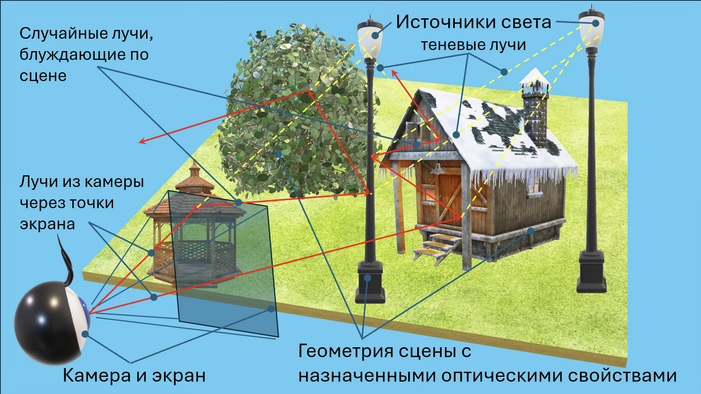

# Лабораторная работа 4

- Выполнили: Кузьмин Артемий Андреевич, Силинцев Владислав Витальевич
- Проверил: Жданов Дмитрий Дмитриевич

## Цель работы

Освоить простейшие методы синтеза изображений трехмерных сцен с учетом глобального освещения методом трассировки путей. Убедиться и доказать корректность сформированного изображения.

## Задание

Построить изображение трехмерной сцены с корректным учетом глобального освещения методом трассировки путей.

## Исходные данные и допущения

- Модель геометрии сцены, формируется треугольной сеткой. Треугольная сетка может быть сформирована вручную или импортирована из OBJ файла. В любом случае необходимо понимать как модель будет выглядеть на изображении. Для поиска точки встречи луча с поверхностью можно написать свою функцию, можно воспользоваться библиотекой Embree (или любой другой библиотекой).
- Цветовая модель – RGB (можно спектральная).
- Модель оптических свойств материалов. Пропускание отсутствует, среда равномерная и прозрачная с постоянным показателем преломления = 1. Оптические свойства на поверхностях: коэффициент диффузного отражения (Ламберт) и коэффициент зеркального отражения (чистое зеркало). Зеркальные и диффузные оптические свойства могут быть заданы одновременно на одной поверхности. Выбирается одно событие (свойство) методами выборки по значимости и русской рулетки. Коэффициенты цветные. Новое направление и цвет луча выбираются в соответствии с выбранным событием. Желательно обеспечить постоянство энергии луча. Более сложные модели (например, Кука-Торранса) возможны, но не обязательны. Обязательное условие – физичность модели, т.е. суммарное отражение для каждой компоненты цвета не превышает 1.
- Камера точечная (можно использовать линзовый объектив, например идеальную тонкую линзу), смотрит и видит сцену. Разрешение до 1000х1000 точек, но не менее 500х500. Антиалиасинг обеспечивается случайным выбором координат точки в пределах одного пикселя.
- Источники света – протяженные, диаграмма излучения – Ламберт. Источники цветные. Расчет прямого освещения можно ограничить одним случайным лучом со случайно выбранного источника света. Использовать выборку по значимости в соответствии с мощностью источника света, току на источнике выбирать случайным образом, Вариация яркости по поверхности треугольника отсутствует.
- Продолжительность расчета можно задать временем, точностью или числом лучей, выпущенных с каждого пикселя изображения.
- Изображение формируется в абсолютных яркостях и потом переводится в область относительных яркостей с нормировкой на некоторое значение (максимальную яркость, среднюю яркость на уровне 0.5, заранее заданную или какую-либо еще). Все, что больше 1, отсекается до уровня 1. Далее применяется гамма-коррекция $V_{corr}=V^{\frac{1}{\gamma}}$ (обычно $\gamma=2.2$), результат приводится к уровню 0-255 и записывается в файл изображения. Простейший формат PPM. Возможен вариант записи изображения в реальных яркостях (например HDR), затем визуализация результата в LumiVue.

## Ход работы

В ходе выполнения лабораторной работы были реализованы следующие этапы:

1. **Разработка математического ядра**: создание классов для работы с векторами, цветами и лучами.
2. **Реализация геометрии**: создание системы представления сцены на основе треугольников и разработка парсера OBJ-файлов для импорта сложных моделей.
3. **Разработка движка трассировки путей**:
    - Реализация модели камеры для генерации первичных лучей с поддержкой антиалиазинга.
    - Написание алгоритма поиска ближайшего пересечения луча с объектами сцены.
    - Реализация рекурсивного процесса трассировки с использованием методов выборки по значимости и «русской рулетки» для управления глубиной рекурсии.
    - Интеграция модели материалов (диффузное и зеркальное отражение).
    - Реализация расчета прямого освещения путем случайного сэмплирования источников света.
4. **Создание сервиса рендеринга**: разработка логики, объединяющей математический движок и систему вывода данных.
5. **Реализация API и вывода**: создание REST-интерфейса для управления процессом рендеринга и запись итоговых изображений в формате PPM с применением гамма-коррекции.

## Алгоритм

Для синтеза изображения используется метод Монте-Карло для решения уравнения рендеринга.

### 1. Генерация лучей

Для каждого пикселя генерируется луч $R(t) = O + tD$, где $O$ — положение камеры, $D$ — направление луча. Для борьбы с алиасингом координаты точки в пределах пикселя выбираются случайно.

### 2. Пересечение с геометрией

Для каждого луча ищется ближайшая точка пересечения $P$ с треугольниками сцены:
$$t_{min} = \min \{ t > \epsilon \mid R(t) \cap \text{Scene} \neq \emptyset \}$$
В точке $P$ определяется нормаль $\vec{N}$ и параметры материала $\rho_d$ (диффузный цвет) и $k_{spec}$ (зеркальный коэффициент).

### 3. Прямое освещение

Для каждого источника света $L_i$ выбирается случайная точка $P_{light}$. Вычисляется вклад прямого освещения по закону Ламберта:
$$C_{dir} = \sum_{i} V(P, P_{light}) \cdot \frac{\rho_d}{\pi} \cdot (\vec{N} \cdot \vec{L}_i) \cdot E_i$$
где:

- $V(P, P_{light})$ — функция видимости (0 или 1), проверяется теневым лучом.
- $\vec{L}_i$ — нормализованный вектор направления на источник света.
- $E_i$ — яркость излучения источника.

### 4. Русская рулетка

Для оптимизации рекурсии используется метод «русской рулетки». Вероятность продолжения трассировки $p$ определяется как максимальная компонента диффузного цвета $\rho_d$:
$$p = \text{clamp}(\max(\rho_{d,r}, \rho_{d,g}, \rho_{d,b}), 0.1, 0.9)$$
Если $\text{rand}(0,1) > p$, рекурсия прекращается и возвращается $C_{dir}$.

### 5. Глобальное освещение

Выбирается направление нового луча $\vec{D}_{new}$:

- С вероятностью $p_{spec} = k_{spec}/100$ — зеркальное отражение:
  $$\vec{D}_{new} = \vec{D}_{in} - 2(\vec{D}_{in} \cdot \vec{N})\vec{N}$$
- С вероятностью $1 - p_{spec}$ — диффузное отражение (сэмплирование полусферы по распределению Ламберта).

Итоговый цвет точки вычисляется как:
$$C = C_{dir} + \frac{1}{p} \cdot \frac{\rho_d}{\pi} \cdot (\vec{N} \cdot \vec{D}_{new}) \cdot C_{indirect}$$
где $C_{indirect}$ — результат рекурсивного вызова функции трассировки для нового луча.

### 6. Пост-обработка

Итоговые яркости $V$ нормируются и подвергаются гамма-коррекции:
$$V_{corr} = V^{\frac{1}{\gamma}}, \quad \gamma = 2.2$$

## Заключение

В результате выполнения работы был разработан полноценный рендерер, использующий метод трассировки путей для синтеза изображений с учетом глобального освещения. Реализованная система поддерживает импорт геометрии из внешних файлов, моделирует физически корректные свойства материалов и обеспечивает высокое качество визуализации за счет использования методов Монте-Карло. Результаты рендеринга подтверждают корректность реализации алгоритма трассировки путей и его способность передавать сложные световые эффекты.
